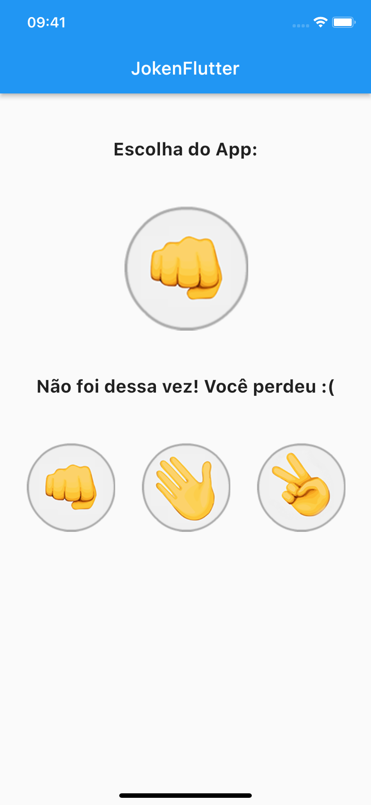

# JokenFlutter
> O famoso jogo Pedra, Papel e Tesoura utilizando o framework Flutter.

Projeto para estudo do framework Flutter e da linguagem Dart.

Apresenta três opções de escolha para o usuário e a seguir valida se a opção aleatória selecionada pelo App vence, perde ou empata, apresentando o resultado no final.

Conteúdo estudado e implementado neste App: componentes de interface, base scaffold, widgets statefull/stateless, atualização de estado e gesture detector.

## Screenshot Android:

## Screenshot iOS:

## Histórico de Atualizações:  

* 20221107:
    * Versão inicial.

## Links:

[https://github.com/danielperesjr/JokenFlutter](https://github.com/danielperesjr/JokenFlutter)